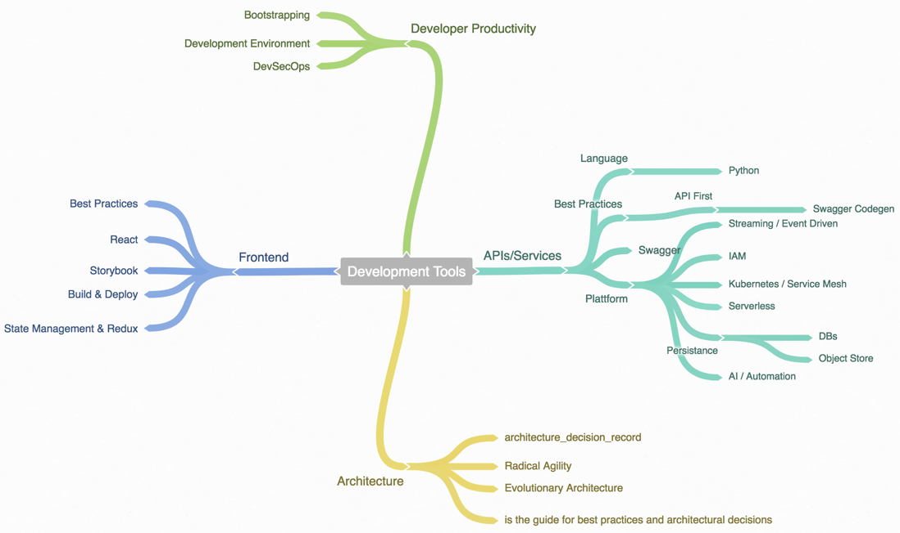

# Introduction

This notebook includes notes on skills you need to build modern applications. The currently the stack looks like this:

### Method

The [architecture principles](architecture.md) are the guiding factors for the \(architecture\) decision made in this playbook.


If you search a specific topic don't forget the search function \(!\)


## Requirements

* Basic programming knowledge \(best Python & Javascript\)
* Mac / Linux / Windows machine
* Know the basic command line

## Who is the target audience?

* Developers how wants to learn how to bootstrap/build production application fast and low cost

