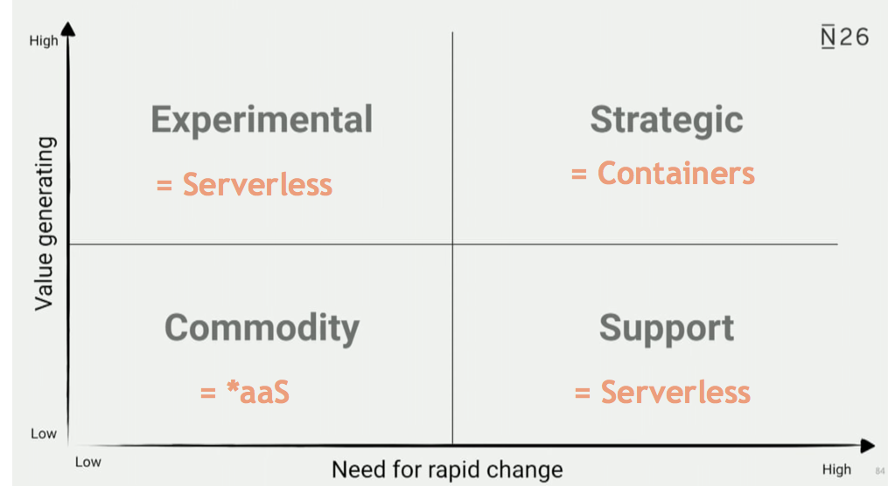

# Bootstraping

To get started fast ask yourself the following questions **how strategic is what i build?** and **how much need for change exists?**: 

## Backend / APIs:

* When I have a small _on demand_ \(I don't expect at least 1 user per hour on average\) function I use serverless: [Serverless Starter](bootstraping.md) 
* When I have _always on_ \(e.g. polling function or expect more then 1 user per hour\) then I use docker: [docker-starter](https://github.com/denseidel/docker-starter) 
* When I expect to have applications that require more then 2 nodes \(e.g. 6+ applications\) then I use the kubernetes/istio with [service-mesh-starter](https://github.com/denseidel/cloud-setup)

## Frontend:

* Setup a Frontend \(including auth and my component library\): [spa-starter](https://github.com/denseidel/spa-starter)

Analytics Pipeline:

* Setup a Data Architecture \(Object Store + Training Pipeline + Models as a Service\): [Analytics Starter](bootstraping.md)

