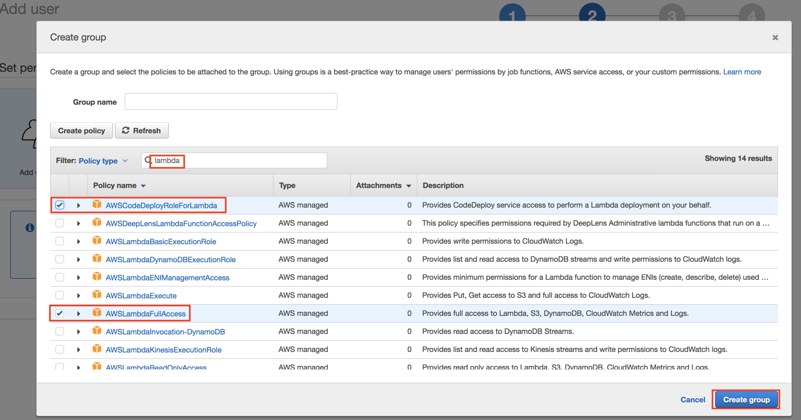
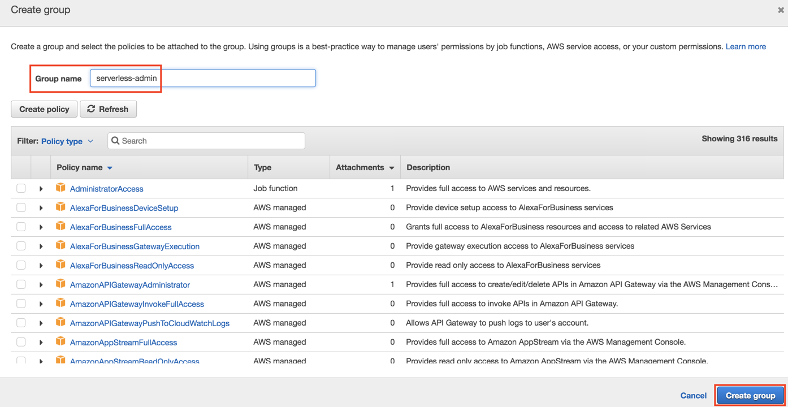
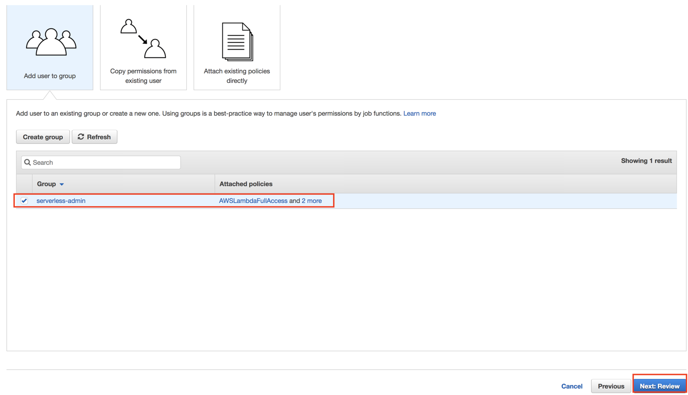
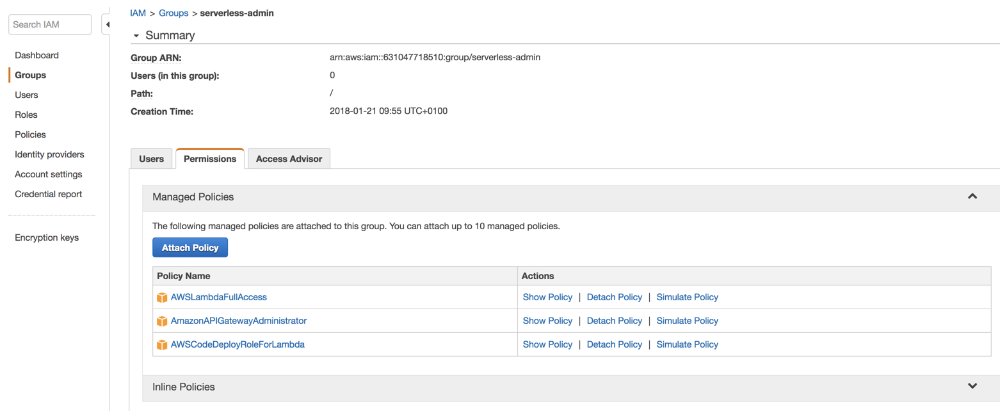
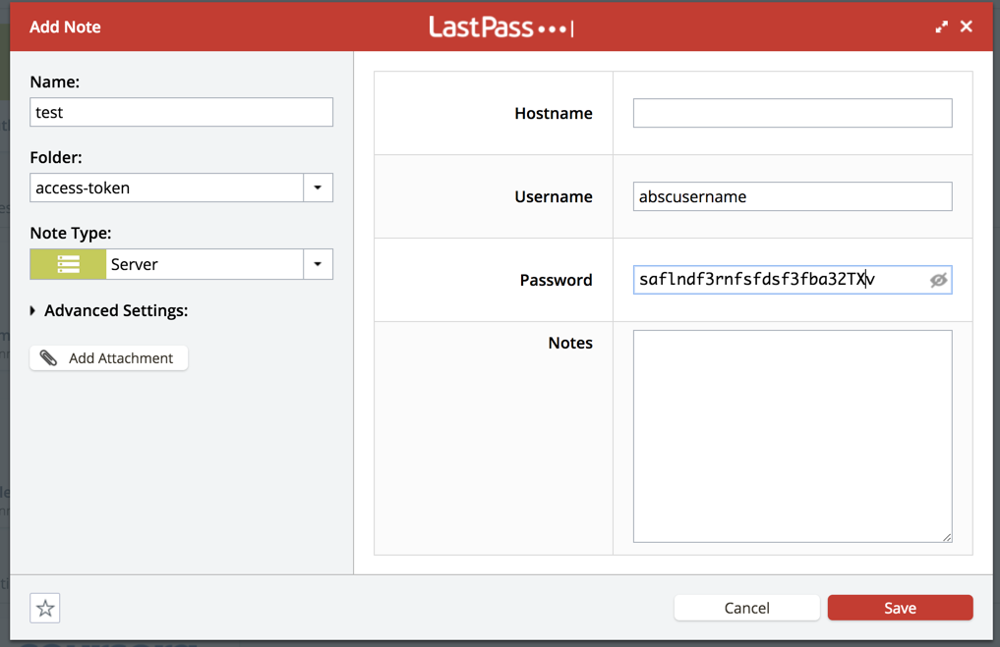

# Accounts \(AWS, GCP, CircleCI\)

## Getting Started with AWS

### Signup for an [AWS](https://aws.amazon.com) account

### Create an IAM role for your use cases e.g. serverless-admin

You don't want to give the serverless-admin access to all feature of aws. Therefore you create a new IAM user that only has the rights a serverless developer needs e.g. access to AWS Lambda, Dynamodb, S3, API Gateway, CloudDeployment and Logs. You use this user for the AWS CLI and the Serverless framework.








#### 




More infos on the required permissions:

{% embed data="{\"url\":\"https://www.bountysource.com/issues/35584735-narrowing-the-serverless-iam-deployment-policy\",\"type\":\"link\",\"title\":\"Post a bounty on serverless/serverless!\",\"description\":\"serverless/serverless\",\"icon\":{\"type\":\"icon\",\"url\":\"https://www.bountysource.com/issues/favicon.ico?v=3\",\"aspectRatio\":0},\"thumbnail\":{\"type\":\"thumbnail\",\"url\":\"https://cloudinary-a.akamaihd.net/bountysource/image/upload/d\_noaoqqwxegvmulwus0un.png,c\_pad,w\_400,h\_400,b\_white/Bountysource\_Animals67\_rzqguf.png\",\"width\":400,\"height\":400,\"aspectRatio\":1}}" %}

```javascript
{
    "Version": "2012-10-17",
    "Statement": [
        {
            "Effect": "Allow",
            "Action": [
                "cloudformation:CreateStack",
                "cloudformation:CreateUploadBucket",
                "cloudformation:DeleteStack",
                "cloudformation:DescribeStackEvents",
                "cloudformation:DescribeStackResource",
                "cloudformation:DescribeStackResources",
                "cloudformation:UpdateStack",
                "cloudformation:DescribeStacks",
                "cloudformation:ValidateTemplate"
            ],
            "Resource": [
                "*"
            ]
        },
        {
            "Effect": "Allow",
            "Action": [
                "s3:GetObject",
                "s3:GetObjectVersion",
                "s3:PutObject",
                "s3:DeleteObject",
                "s3:CreateBucket",
                "s3:DeleteBucket",
                "s3:ListBucket",
                "s3:ListBucketVersions",
                "s3:GetBucketVersioning",
                "s3:PutBucketVersioning",
                "s3:GetBucketLocation"
            ],
            "Resource": [
                "arn:aws:s3:::*"
            ]
        },
        {
            "Effect": "Allow",
            "Action": [
                "lambda:CreateFunction",
                "lambda:PublishVersion",
                "lambda:GetFunction",
                "lambda:GetFunctionConfiguration",
                "lambda:DeleteFunction",
                "lambda:ListVersionsByFunction"
            ],
            "Resource": [
                "arn:aws:lambda:eu-central-1:*:function:*"
            ]
        },
        {
            "Effect": "Allow",
            "Action": [
                "iam:CreateRole",
                "iam:DeleteRole",
                "iam:GetRole",
                "iam:PassRole",
                "iam:DeleteRolePolicy",
                "iam:PutRolePolicy"
            ],
            "Resource": [
                "arn:aws:iam::*:role/*"
            ]
        },
        {
            "Effect": "Allow",
            "Action": [
                "logs:DescribeLogStreams",
                "logs:FilterLogEvents"
            ],
            "Resource": [
                "*"
            ]
        },
        {
            "Effect": "Allow",
            "Action": [
                "cloudwatch:GetMetricStatistics"
            ],
            "Resource": [
                "*"
            ]
        }
    ]
}
```

### Install AWS CLI

```bash
sudo pip install awscli
# use the access key id and secret access ky as describe above
aws configure
# AWS Access Key ID [None]: AKIAI44QH8DHBEXAMPLE
# AWS Secret Access Key [None]: je7MtGbClwBF/2Zp9Utk/h3yCo8nvbEXAMPLEKEY
# Default region name [None]: eu-central-1
# Default output format [None]:

# for the man pages do
aws configure help
```

Source: [https://docs.aws.amazon.com/de\_de/cli/latest/userguide/cli-chap-getting-started.html](https://docs.aws.amazon.com/de_de/cli/latest/userguide/cli-chap-getting-started.html)

#### Configure multiple Profiles:

```text
vi ~/.aws/credentials
```

```text
[default]
aws_access_key_id=XXX
aws_secret_access_key=XXX

[serverless-admin]
aws_access_key_id=AKIAI44QH8DHBEXAMPLE
aws_secret_access_key=je7MtGbClwBF/2Zp9Utk/h3yCo8nvbEXAMPLEKEY
```

Set the profile:

```text
export AWS_PROFILE=serverless-admin
```

Source: [https://docs.aws.amazon.com/cli/latest/userguide/cli-multiple-profiles.html](https://docs.aws.amazon.com/cli/latest/userguide/cli-multiple-profiles.html)


## Securely store your keys and secrets in your rsh file

You don't want to store your secrets in plain text in a file like `.rshrc`  therefore you can use lpass cli \[[github](https://github.com/lastpass/lastpass-cli) / [documentation](https://helpdesk.lastpass.com/lastpass-command-line-application/)\] and store your secrets in your osx keychain and access them only by reference.

#### Installation

```bash
brew install lastpass-cli --with-pinentry
```

#### Set variables in lastpass

Just create a secret note within lastpass:



#### Login to lpass in the command line

```bash
# login to lastpass
# check first if I am allready loggedin and finded the "access-token" folder 
if [[ $(lpass ls) != *"access-token"* ]]; then
lpass login your@email.com
fi
```

#### Set environment variable \(e.g. key\_id \(username\) and secret\(password\)

```bash
export AWS_ACCESS_KEY_ID=$(lpass show aws-serverless-devops --username)
export AWS_SECRET_ACCESS_KEY=$(lpass show aws-serverless-devops --password)
```

## Getting started with GCP

* [Setup Google Cloud Functions for Serverless](https://serverless.com/framework/docs/providers/google/guide/credentials/):
  * Create a Google Cloud Billing Account
  * Create a new Google Cloud Project
  * Enable the necessary APIs
  * Get credentials
  * For serverless: Update the `provider` config in `serverless.yml`


### Accessing files in lpass

```text
lpass show xxx-dev-gcp --attach att-7942806310206912061-56085
```

### Setup an ecrypted folder and sync with google drive

```text
/Users/den/Desktop/secret/xxx/key.json
lock-secret-files
unlock-secret-files
```

