# Frontend

## Frontend

After you defined the business functionality - expressed most clearly by the APIs of a domain - by creating your API mocks, you start building your UI.

**Architectural Decisions**

1. [I use a basic css framework Bulma, because more powerful frameworks cost to much time understanding without understanding the basics.](https://github.com/denseidel/developer-playbook/blob/master/adr/2018-02-24%20Fontend%20Ui%20Framework.md)
2. \*TODO: Create ADR\* I stick with React up to the point that the others are at least on the same functional level: Native and Frontend.

### Development Process

1. [Design and Develop API Mock](../services-api/)
2. [Understand the tech stack](./#technology-stack)
3. [Rapid Prototyping](./#rapid-prototyping)
4. [Build an app with component based development](./#build-an-app)
5. Decide if you deploy the application serverless or use docker containers \(vendor independent\)
   1. [Dockerize a react application](./#dockerize-a-react-app)

### Technology Stack {#technology-stack}

* Build Setup: _ES6, webpack, babel, npm_
* Frontend Framework: _React \(_[_ecosystem overview_](https://github.com/enaqx/awesome-react) _/_ [_course_](https://www.udemy.com/react-the-complete-guide-incl-redux/)_\) - JSX, State, Life Cycle Methods_
* State Management: _Redux + Redux Saga_
* Web/Desktop:
  * _React  with Create-React-App_
  * _CSS Framework - Bulma /_ [_blueprintjs_](http://blueprintjs.com/)
* Web/Mobile:
  * _CSS Framework - Bulma_
* Native:
  * _React Native_

### Rapid Prototyping {#rapid-prototyping}

To get feedback fast create a first prototype:

**Define Application Structure \(Paper? + Photo or Balsamiq + screenshot from rolemodels\):**

1. LandingPage \(login or not\)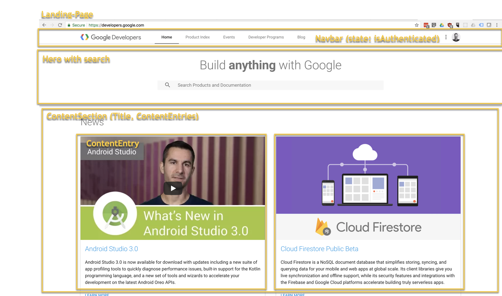2. Personal Service Page \(only logged in\)

   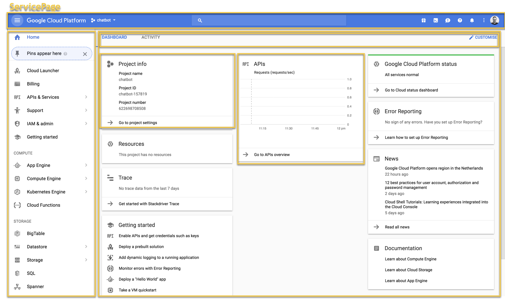

### Build a mock?  {#build-an-app}

* [https://moqups.com/pricing/sign-up?p=Ewy0d](https://moqups.com/pricing/sign-up?p=Ewy0d)
* [https://projects.invisionapp.com/d/signup](https://projects.invisionapp.com/d/signup)

###  {#build-an-app}

### Build an app with component based development {#build-an-app}

**Create sampleapp-client**

```text
create-react-app sampleapp-client
cd sampleapp-client
```

**Setup Project Structure**

Theory: [https://hackernoon.com/my-journey-toward-a-maintainable-project-structure-for-react-redux-b05dfd999b5](https://hackernoon.com/my-journey-toward-a-maintainable-project-structure-for-react-redux-b05dfd999b5)

```text
src
 ├── components
 │
 ├── containers
 │  ├── auth.js
 │  ├── productList.js
 │  └── productDetail.js
 │
 ├── reducers (aka ducks)
 │  ├── index.js (combineReducers + complex selectors)
 │  ├── auth.js (reducers, action types, actions creators, selectors)
 │  └── product.js (reducers, action types, actions creators, selectors)
 │
 ├── sagas
 │  ├── index.js (root saga/table of content of all the sagas)
 │  ├── auth.js
 │  └── product.js
 │
 └── services
    ├── authenticationService.js
    └── productsApi.js
```

[Code on github](https://github.com/denseidel/spa-starter/commit/25a4f36d7997e78dc3233f917561c6ed49badbc3)

**Create Router and setup basic Application structure**

Link: [https://github.com/ReactTraining/react-router](https://github.com/ReactTraining/react-router) / [https://reacttraining.com/react-router/web/guides/quick-start](https://reacttraining.com/react-router/web/guides/quick-start)

Install: `npm i react-router-dom`

Setup Routers: [Code on github](https://github.com/denseidel/spa-starter/commit/10b7952eaaa8a5977a8636612845bcae86da937f)

**Create Placeholder Components/Containers:**

[Code on github](https://github.com/denseidel/spa-starter/commit/c3b7246f4ab22dee7e11f6aa27fe3f792fa7fb43)

**Setup CSS Framework for Styling**

I currently use [Bulma](https://bulma.io/documentation/overview/start/) / [BulmaThemes](https://jenil.github.io/bulmaswatch/) and [FontAwesome](http://fontawesome.io/get-started/):

Include link to css in index.html or[ use npm](https://bulma.io/documentation/overview/start/) \(recomended\)

[Code on github](https://github.com/denseidel/spa-starter/commit/7c87cd95d7965571cfd38c5716f47c2e60f455f2)

* [Tutorial on using Bulma](https://scotch.io/bar-talk/get-to-know-bulma-my-current-favorite-css-framework)
* [Example how to use Bulma](https://medium.freecodecamp.org/colorful-fundamentals-the-reward-of-building-with-bulma-7b14883317bd)

**Install storybook.js and configure it**

Basic Setup: [https://storybook.js.org/basics/guide-react/](https://storybook.js.org/basics/guide-react/)

```text
npm i --save-dev @storybook/react
```

Configure Storybook \[[Code](https://github.com/denseidel/sampleapp-client/commit/62cf7e1f02a887f71e9833d5cf071ca11d880c53)\]

Further Setup:

* [what are action, decorators ...](https://blog.hichroma.com/introduction-to-storybook-5aca8cc643f7)
* [with bulma.io](http://ouicar.github.io/2017/01/05/storybook-2.html) 
* [customize SASS](http://andreafalzetti.github.io/blog/2017/05/30/bundling-react-15-bootstrap-4-storybook-3-with-webpack-2.html)

Create Container/Componente LoginPage \(might be a container in the future\):

`/src/container/LoginPage`

in its own folder in this folder you then find the `LoginPage.js` file, `.css` , pictures \(`.svg`\) and the story `LoginPage-story.js`

Example how IBM is doing it:

* Component [https://github.com/carbon-design-system/carbon-components-react/tree/master/src/components/Accordion](https://github.com/carbon-design-system/carbon-components-react/tree/master/src/components/Accordion)
* Config: [https://github.com/carbon-design-system/carbon-components-react/blob/master/.storybook/config.js](https://github.com/carbon-design-system/carbon-components-react/blob/master/.storybook/config.js)
* Storybook: [http://react.carbondesignsystem.com/?selectedKind=Accordion&selectedStory=Default&full=0&addons=1&stories=1&panelRight=0&addonPanel=storybook%2Factions%2Factions-panel](http://react.carbondesignsystem.com/?selectedKind=Accordion&selectedStory=Default&full=0&addons=1&stories=1&panelRight=0&addonPanel=storybook%2Factions%2Factions-panel)
* Webpack config \(to use\): [https://github.com/carbon-design-system/carbon-components-react/blob/master/.storybook/webpack.config.js](https://github.com/carbon-design-system/carbon-components-react/blob/master/.storybook/webpack.config.js)
* How to use in project: [https://github.com/carbon-design-system/carbon-components-react\#usage](https://github.com/carbon-design-system/carbon-components-react#usage)

**Developer Components in Stylebook:**

Sample: [https://github.com/kadira-samples/react-storybook-demo/blob/master/components/stories/MainSection.js](https://github.com/kadira-samples/react-storybook-demo/blob/master/components/stories/MainSection.js)

[Code on github](https://github.com/denseidel/spa-starter/commit/9e7d246cf92820b834e4c0e55b7f461401c1c813)

Run Storybook: `npm run storybook`

* Using ReactRouter with history: 
  * [https://stackoverflow.com/questions/42701129/how-to-push-to-history-in-react-router-v4](https://stackoverflow.com/questions/42701129/how-to-push-to-history-in-react-router-v4)
  * [https://reacttraining.com/react-router/web/guides/redux-integration](https://reacttraining.com/react-router/web/guides/redux-integration)
  * [https://github.com/ReactTraining/react-router/blob/master/FAQ.md\#how-do-i-access-the-history-object-outside-of-components](https://github.com/ReactTraining/react-router/blob/master/FAQ.md#how-do-i-access-the-history-object-outside-of-components)
  * [https://stackoverflow.com/questions/43279135/reactjs-router-v4-history-push-not-working/43280171](https://stackoverflow.com/questions/43279135/reactjs-router-v4-history-push-not-working/43280171)
  * use **withRouter on at least App and otherwise use a manual history object**
  * [https://github.com/ReactTraining/react-router/issues/4924](https://github.com/ReactTraining/react-router/issues/4924)
  * [https://reacttraining.com/react-router/web/example/auth-workflow](https://reacttraining.com/react-router/web/example/auth-workflow)
* Frontend Tracking with Google Analytics: 
  * [https://github.com/react-ga/react-ga](https://github.com/react-ga/react-ga)
  * [https://web-design-weekly.com/2016/07/08/adding-google-analytics-react-application/](https://web-design-weekly.com/2016/07/08/adding-google-analytics-react-application/)

## Make AJAX / REST Calls from the Frontend with axios

[https://medium.com/codingthesmartway-com-blog/getting-started-with-axios-166cb0035237](https://medium.com/codingthesmartway-com-blog/getting-started-with-axios-166cb0035237)

### Dockerize a React App {#dockerize-a-react-app}

1. [http://mherman.org/blog/2017/12/07/dockerizing-a-react-app/](http://mherman.org/blog/2017/12/07/dockerizing-a-react-app/)
2. [https://www.peterbe.com/plog/how-to-create-react-app-with-docker](https://www.peterbe.com/plog/how-to-create-react-app-with-docker)

### Deploy the Frontend

1. Upload the assets of our app
2. Use a CDN to serve out our assets
3. Point our domain to the CDN distribution
4. Switch to HTTPS with a SSL certificate

AWS provides quite a few services that can help us do the above. We are going to use[S3](https://aws.amazon.com/s3/) to host our assets,[CloudFront](https://aws.amazon.com/cloudfront/) to serve it, [Route 53](https://aws.amazon.com/route53/)to manage our domain, and [Certificate Manager](https://aws.amazon.com/certificate-manager/) to handle our SSL certificate.

#### Create the Bucket {#create-the-bucket}

First, log in to your[AWS Console](https://console.aws.amazon.com/)and select S3 from the list of services.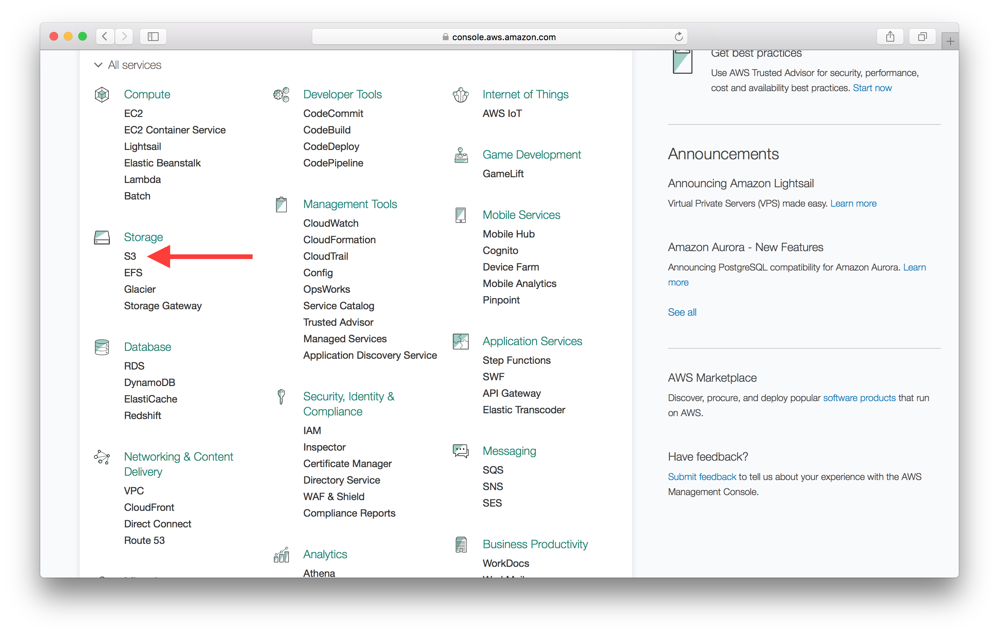

Select **Create Bucket**and pick a name for your application and select the **US East \(N. Virginia\) Region** Region. Since our application is being served out using a CDN, the region should not matter to us.

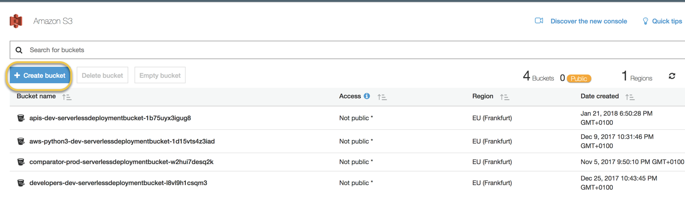  
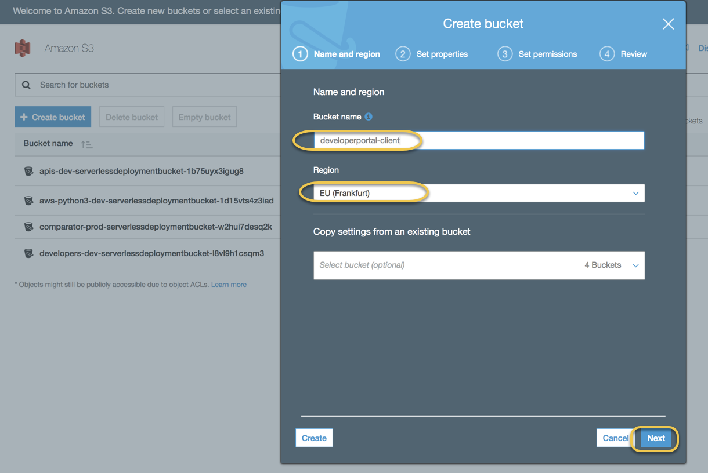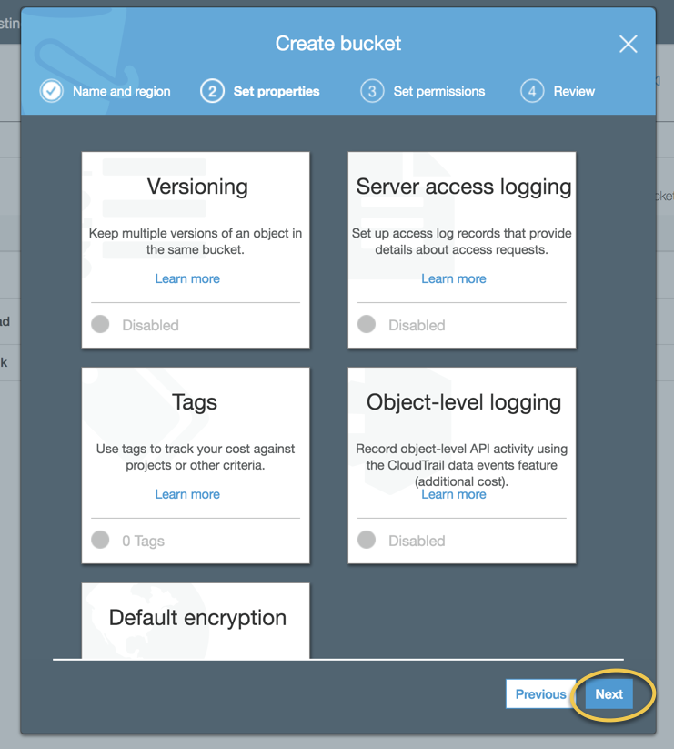

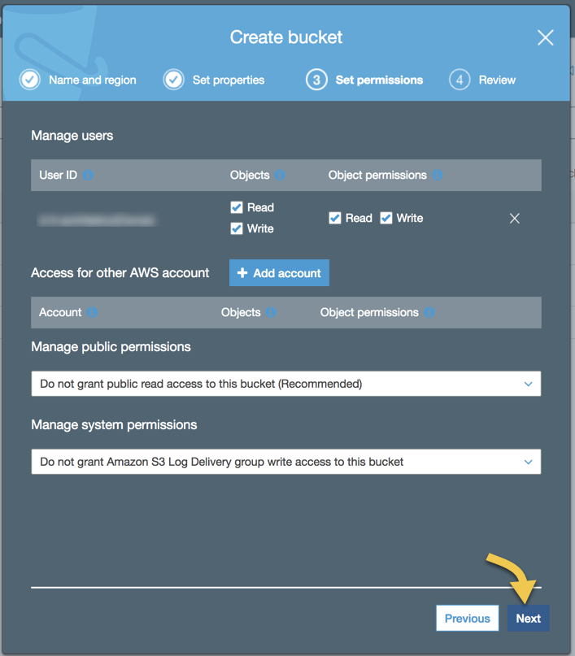

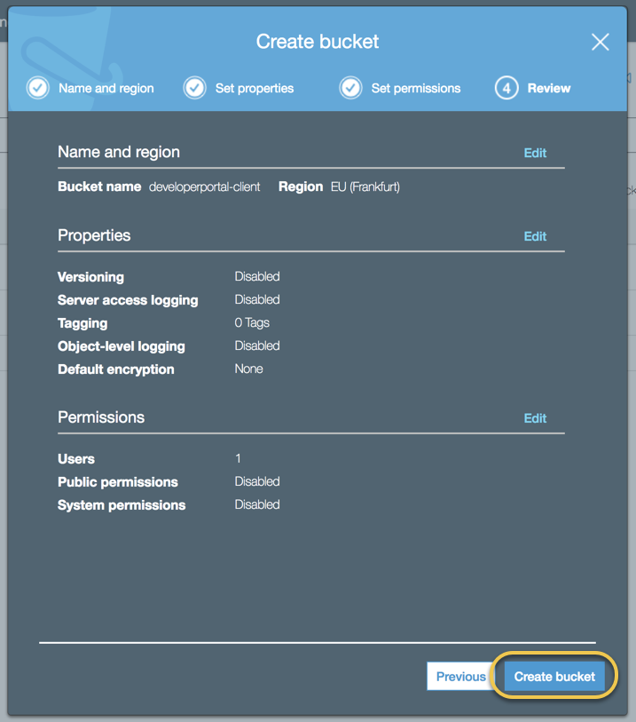

Now click on your newly created bucket from the list and navigate to its permissions panel by clicking **Permissions**.

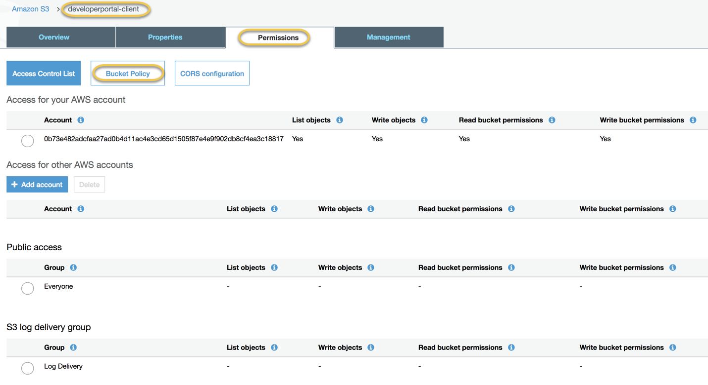

```text
{
  "Version":"2012-10-17",
  "Statement":[{
    "Sid":"PublicReadForGetBucketObjects",
        "Effect":"Allow",
      "Principal": "*",
      "Action":["s3:GetObject"],
      "Resource":["arn:aws:s3:::developerportal-client/*"]
    }
  ]
}
```

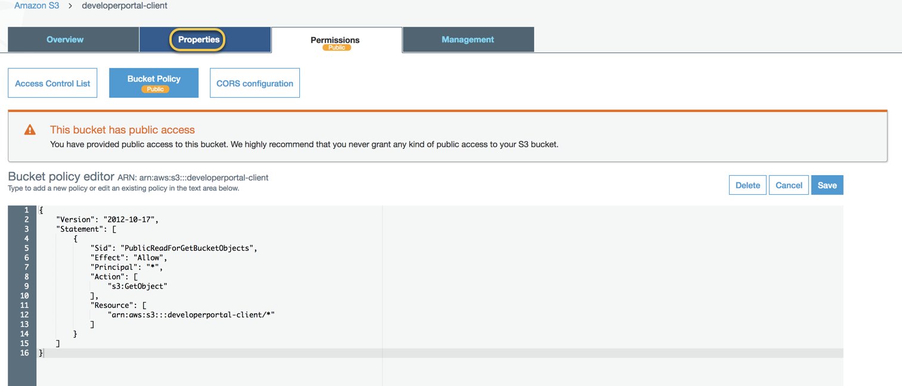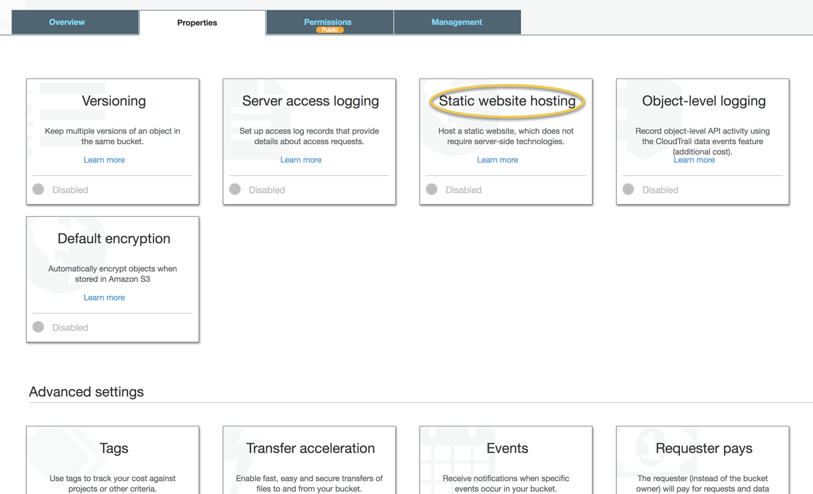

Now select **Use this bucket to host a website** and add our`index.html`as the **Index Document** and the **Error Document**. Since we are letting React handle 404s, we can simply redirect our errors to our`index.html`as well. Hit **Save** once you are done.

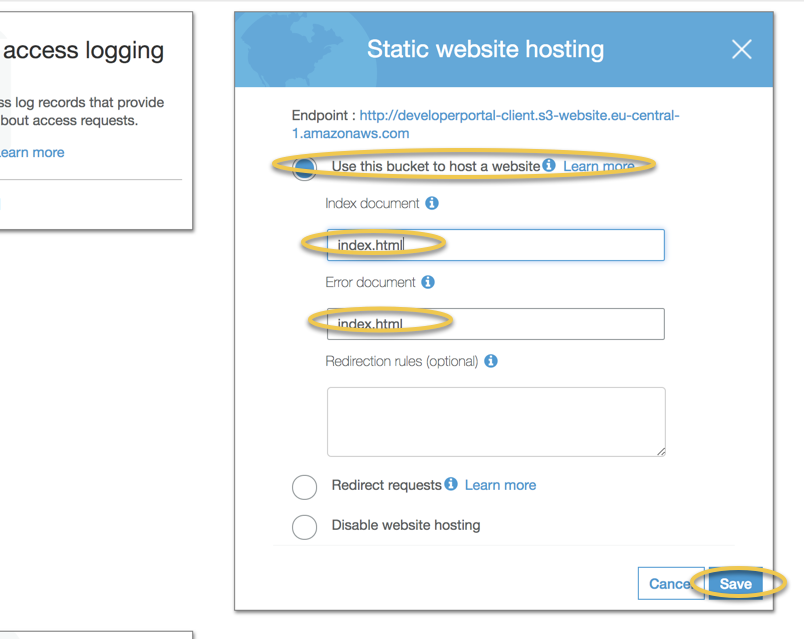

This panel also shows us where our app will be accessible. AWS assigns us a URL for our static website. In this case the URL assigned to me is `http://developerportal-client.s3-website.eu-central-1.amazonaws.com`.

### Build Our App

Create React App comes with a convenient way to package and prepare our app for deployment. From our working directory simply run the following command.

```text
npm run build
```

This packages all of our assets and places them in the`build/`directory.

#### Upload to S3 {#upload-to-s3}

Now to deploy simply run the following command; where`YOUR_S3_DEPLOY_BUCKET_NAME`is the name of the S3 Bucket we created before.

```text
aws s3 sync build/ s3://YOUR_S3_DEPLOY_BUCKET_NAME 
// aws s3 sync build/ s3://developerportal-client
```

All this command does is that it syncs the`build/`directory with our bucket on S3. Just as a sanity check, go into the S3 section in your [AWS Console](https://console.aws.amazon.com/console/home) and check if your bucket has the files we just uploaded.

## Code Quality & Testing

* [https://medium.com/@eliotjunior/prettier-eslint-facebook-code-quality-the-auto-magical-react-styling-tutorial-19481acb10dd](https://medium.com/@eliotjunior/prettier-eslint-facebook-code-quality-the-auto-magical-react-styling-tutorial-19481acb10dd)
* unit testing framework
* component based testing frameworks

how to build this into the build pipeline?

### Micro-Frontends How to integrate multiple Frontends into one \(token in local storage?\)?

[https://medium.com/@tomsoderlund/micro-frontends-a-microservice-approach-to-front-end-web-development-f325ebdadc16](https://medium.com/@tomsoderlund/micro-frontends-a-microservice-approach-to-front-end-web-development-f325ebdadc16)

* Authenticated Session with the SSO / Login page and inquiry without user interaction: [https://community.auth0.com/questions/7605/sharing-authentication-between-2-sites](https://community.auth0.com/questions/7605/sharing-authentication-between-2-sites)
* Code splitting to multiple pages in react:
  * [https://blog.logrocket.com/quick-guide-to-webpack-bundle-and-code-splitting-with-react-43d1045f1064](https://blog.logrocket.com/quick-guide-to-webpack-bundle-and-code-splitting-with-react-43d1045f1064)
  * [https://stackoverflow.com/questions/39314251/reactjs-how-to-have-multiple-spas-on-the-same-website](https://stackoverflow.com/questions/39314251/reactjs-how-to-have-multiple-spas-on-the-same-website)
* single-spa:
  * [https://medium.com/canopy-tax/a-step-by-step-guide-to-single-spa-abbbcb1bedc6](https://medium.com/canopy-tax/a-step-by-step-guide-to-single-spa-abbbcb1bedc6)
  * [https://www.thoughtworks.com/de/radar/languages-and-frameworks/single-spa](https://www.thoughtworks.com/de/radar/languages-and-frameworks/single-spa)
  * [https://github.com/CanopyTax/single-spa](https://github.com/CanopyTax/single-spa)
* Serverside Rendering: [https://github.com/phodal/serverless-react-server-side-render/blob/master/src/index.js](https://github.com/phodal/serverless-react-server-side-render/blob/master/src/index.js)
* AWS Amplify: [https://github.com/d0ruk/serverless-notes-app/tree/master/client](https://github.com/d0ruk/serverless-notes-app/tree/master/client)
* Create new Component Mock and Create new StoryBook \(e.g. copying the one of the old component\): [https://github.com/denseidel/spa-starter/commit/94d64cbfa949108977a159ccf4ad409fd0c317ea](https://github.com/denseidel/spa-starter/commit/94d64cbfa949108977a159ccf4ad409fd0c317ea)
* Implement new component logic [https://github.com/denseidel/spa-starter/commit/726cd1e16be73186ea535e5ac1129e3aee16206c](https://github.com/denseidel/spa-starter/commit/726cd1e16be73186ea535e5ac1129e3aee16206c)

Design:

* [https://medium.com/refactoring-ui/7-practical-tips-for-cheating-at-design-40c736799886](https://medium.com/refactoring-ui/7-practical-tips-for-cheating-at-design-40c736799886)

