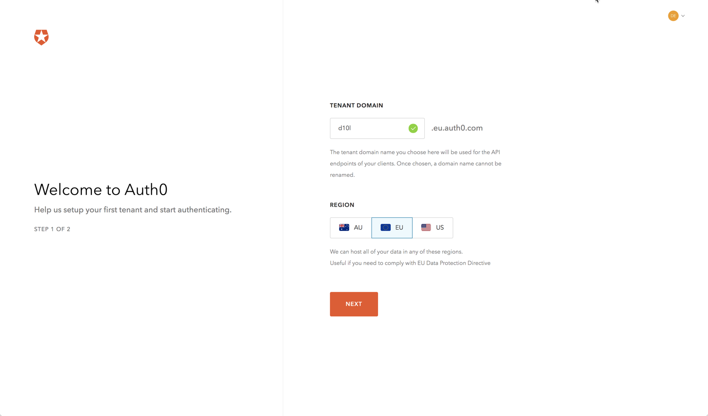
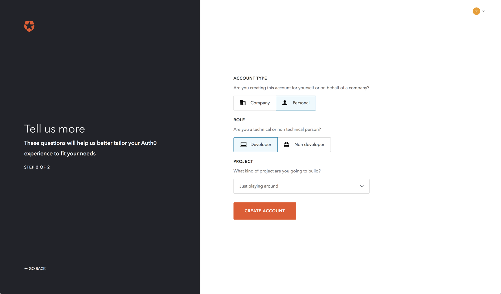

# IAM - IAMaaS

To secure your app and mange user identities you can either build your own secuirty \(which is bad practice unless you are a security startup that sees it advantage in build novel and better security\), use a existing solution like keycloak and integrate it into your application or use a SaaS solution that provides you Identitymanagement.

## Products

* Host your own: 
  * [Keycloak](http://www.keycloak.org)
  * [Forgerock](https://backstage.forgerock.com/docs/am)
* SaaS
  * [AWS Cognito](https://aws.amazon.com/de/cognito/): AWS specific, not good for multi cloud
  * [Auth0](https://auth0.com/): large community
  * [Bitium](https://www.bitium.com/): Bought by google

Tasks to build a MVP that shows you the different Aspects of building an Identity Plattform:

* Register with IAMaaS
* Build Sample App that authenticated via SSO with your IaaS
* Configure the provider so it integrates with your domain - so that it looks like your own webpage
* Create Backend API and protect it with IAM
* Integrate API Gateway with IAM
* Expose API on API Gateway
* Build Developer Portal and Integrate it with IAM for Signup, Management of Clients and Signup of APIs

Eigene APIs ? In CISL?

Architecture diagram: multicloud ... what security \(IP ranges ... as Apigee what they suggest\)

As Auth0 is currently most established in the community and AWS Cognito is AWS specific: Auth0 is currently the best option - Bitium is currently integrated into the Google Platform and it will be interesting to see i which direction Google will go.


## Cognito


1. Create User Pool in Cognito with _Pool name_ ```notes-user-pool``  and choose username attributes and select email adress or phone numbers and allow email addresses. Finish and _note the Pool ID and Pool ARN_. 
2. Create App clients in the Cognito User Pool with _App client name_ `notes-app` and _refresh token expiration_ `30` and _Generate client secret_ `deselected` and  _Enable sign-in API server-based authentication_ `selected`. Finish and _note the App client id_.

```text
# create user
aws cognito-idp sign-up --region eu-central-1 --client-id YOUR_CLIENTID --username admin@yourmail.com --password passw0rD
# verfiy user
aws cognito-idp admin-confirm-sign-up --region eu-central-1 --user-pool-id YOUR_USERPOOL_ID --username admin@yourmail.com
```


### Register with IAMaaS

1. Signup with [Auth0](https://auth0.com/signup)

   

### Build Sample App that authenticated via SSO with your IaaS

Instead of building your own login page - we will redirect to a Auth0 Login Page, then readirect back to our app with an id token attached that included the identity of the user. This token is stored on the local storage of the device and our application will use this token to sign the user in otherwise redirect him to the login page.

Tutorials:

* [https://github.com/auth0-samples/auth0-react-samples](https://github.com/auth0-samples/auth0-react-samples)
* [https://auth0.com/blog/build-a-chat-app-with-react/](https://auth0.com/blog/build-a-chat-app-with-react/)
* [https://github.com/auth0-blog/reactjs-authentication-tutorial](https://github.com/auth0-blog/reactjs-authentication-tutorial)
* [https://auth0.com/blog/reactjs-authentication-tutorial/?utm\_source=medium&utm\_medium=sc&utm\_campaign=reactjs\_authentication](https://auth0.com/blog/reactjs-authentication-tutorial/?utm_source=medium&utm_medium=sc&utm_campaign=reactjs_authentication)
* [https://www.udemy.com/complete-react-js-course/](https://www.udemy.com/complete-react-js-course/)

Test With Postmen - Bearer Token: [https://stackoverflow.com/questions/24709944/jwt-token-in-postman-header](https://stackoverflow.com/questions/24709944/jwt-token-in-postman-header)

Developer Portal:

* Management API: 
  * [https://auth0.com/docs/api/management/v2/tokens](https://auth0.com/docs/api/management/v2/tokens)
  * [https://auth0.com/docs/api/management/v2\#!/Client\_Grants/post\_client\_grants](https://auth0.com/docs/api/management/v2#!/Client_Grants/post_client_grants)

Integrate Auth0 with AWS: [https://aws.amazon.com/blogs/apn/how-to-integrate-rest-apis-with-single-page-apps-and-secure-them-using-auth0-part-1/](https://aws.amazon.com/blogs/apn/how-to-integrate-rest-apis-with-single-page-apps-and-secure-them-using-auth0-part-1/)

Secure the API:

* [https://auth0.com/docs/architecture-scenarios/application/spa-api](https://auth0.com/docs/architecture-scenarios/application/spa-api)

Integrate API Gateway with Auth0:

* [https://github.com/swilliams11/apigee-auth0-external-authorization](https://github.com/swilliams11/apigee-auth0-external-authorization)
* [https://community.apigee.com/articles/43082/auth0-with-apigee-external-authorization.html](https://community.apigee.com/articles/43082/auth0-with-apigee-external-authorization.html)
* [https://community.apigee.com/articles/42269/auth0-with-apigee.html](https://community.apigee.com/articles/42269/auth0-with-apigee.html)
* [https://community.apigee.com/questions/32498/how-to-register-a-third-party-access-token-obtaine.html](https://community.apigee.com/questions/32498/how-to-register-a-third-party-access-token-obtaine.html)

Delegated Access Control and Multiple APIs "Audiances":

* [https://community.auth0.com/questions/4420/webauth-audience-multiple-apis-and-scopes](https://community.auth0.com/questions/4420/webauth-audience-multiple-apis-and-scopes)
* [https://community.auth0.com/questions/7539/how-to-handle-multiple-apis-using-audience-token](https://community.auth0.com/questions/7539/how-to-handle-multiple-apis-using-audience-token)
* [https://auth0.com/docs/api-auth/tutorials/represent-multiple-apis](https://auth0.com/docs/api-auth/tutorials/represent-multiple-apis)
* [https://community.auth0.com/questions/4907/token-exchange-multiple-audiences](https://community.auth0.com/questions/4907/token-exchange-multiple-audiences)
* Google Sample
  * Playground: [https://developers.google.com/oauthplayground/?error=access\_denied\#](https://developers.google.com/oauthplayground/?error=access_denied#)
  * [https://stackoverflow.com/questions/359472/how-can-i-verify-a-google-authentication-api-access-token](https://stackoverflow.com/questions/359472/how-can-i-verify-a-google-authentication-api-access-token)

[https://www.googleapis.com/oauth2/v1/tokeninfo?access\_token=ya29.GltQBaDL5XGrEinAjYr\_E7WPPvzrHqahgyr5SaglbA6opHQ\_dgy-2WYKcr3sGFePre0zsBN91FjCdQqiko4dl6yvlIep2IVnhyIANT6NA7d7hGp8ETjhax-FEr-w](https://www.googleapis.com/oauth2/v1/tokeninfo?access_token=ya29.GltQBaDL5XGrEinAjYr_E7WPPvzrHqahgyr5SaglbA6opHQ_dgy-2WYKcr3sGFePre0zsBN91FjCdQqiko4dl6yvlIep2IVnhyIANT6NA7d7hGp8ETjhax-FEr-w)

```text
{
 "issued_to": "407408718192.apps.googleusercontent.com",
 "audience": "407408718192.apps.googleusercontent.com",
 "scope": "https://www.googleapis.com/auth/calendar https://www.googleapis.com/auth/drive https://www.googleapis.com/auth/gmail.readonly https://www.googleapis.com/auth/tasks",
 "expires_in": 3441,
 "access_type": "offline"
}
```

access control sollte fühest möglich in der kette statt finden daher neuer token für jeden call

React Tutorial: [https://auth0.com/docs/quickstart/spa/react/01-login](https://auth0.com/docs/quickstart/spa/react/01-login)

```text
npm install --save auth0-js
```

Configure a hosted page with auth0: [https://auth0.com/docs/quickstart/spa/react/01-login\#add-authentication-with-auth0](https://auth0.com/docs/quickstart/spa/react/01-login#add-authentication-with-auth0)

### JWT vs opaque tokens

* JWT: [https://jobs.zalando.com/tech/blog/the-purpose-of-jwt-stateless-authentication/](https://jobs.zalando.com/tech/blog/the-purpose-of-jwt-stateless-authentication/)
* Google uses a central system 

Design the system:

* What type of access:
  * functional \(bring your own data\) - is normally only restricted by utilization \(in some case also by a role\) 
  * self access - is normally done with a 3 legged oauth at login time and later in the background with the refresh token?
  * delegated access \(there might be a solution with [user managed access](https://www.forgerock.com/privacy/user-managed-access).  
* what information does a service need to make a decision in what kind of cenario it is?
  * functional access can be decide at build time: 
  * identity: this needs to be compared if it is the same - then self access 
    * in the token 
    * in the payload 
  * role, group, permission, delegation: 

