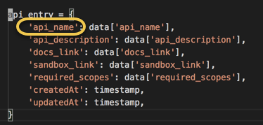

# Persistance - DBaaS

## Perstistance

Every microservice should use it's own persitance layer. Optimally this will be a SasS solution. The current list of database can be discovered [hear](https://db-engines.com/de/ranking) and the [zalando technology radar](persistance-dbaas.md).

#### Architectural Decisions

### When to use NoSQL and when RDBS?

Why DynamoDB?

pynamodb \(ORM\) - my experience \(ask in stack overflow with a link to my describe esperience and the code\) why cann't I serialize it back?

boto3 - prefered way by amazon.

[https://www.youtube.com/watch?v=ONLKIUFXLcg&t=2s](https://www.youtube.com/watch?v=ONLKIUFXLcg&t=2s)

[https://www.uplift.agency/blog/posts/2016/03/clearcare-dynamodb](https://www.uplift.agency/blog/posts/2016/03/clearcare-dynamodb)

1. Go to the [AWS Console](https://console.aws.amazon.com/console/home) and Search for "DynamoDB"

   

2. Create a table e.g. "apis"  
   

   

Important: Partition Key Fieldname can not be changed and it must always be included when you insert data to the database. Like:

Further you validate in your that a valid value was send to your service.

## Containerized NoSQL - Mongodb

**Docker Setup**

* Intro: 
  * [https://hub.docker.com/r/bitnami/mongodb/](https://hub.docker.com/r/bitnami/mongodb/)
  * [https://www.mongodb.com/blog/post/running-mongodb-as-a-microservice-with-docker-and-kubernetes](https://www.mongodb.com/blog/post/running-mongodb-as-a-microservice-with-docker-and-kubernetes)
  * [https://medium.com/@pablo\_ezequiel/creating-a-docker-image-with-mongodb-4c8aa3f828f2](https://medium.com/@pablo_ezequiel/creating-a-docker-image-with-mongodb-4c8aa3f828f2)
  * [http://blog.bejanalex.com/2017/03/running-mongodb-in-a-docker-container-with-authentication/](http://blog.bejanalex.com/2017/03/running-mongodb-in-a-docker-container-with-authentication/)
* ReplicaSets: 

**Working with Mongodb in Python**

* [https://realpython.com/blog/python/introduction-to-mongodb-and-python/](https://realpython.com/blog/python/introduction-to-mongodb-and-python/)
* [https://www.mongodb.com/blog/post/getting-started-with-python-and-mongodb](https://www.mongodb.com/blog/post/getting-started-with-python-and-mongodb)
* [https://docs.mongodb.com/getting-started/python/client/](https://docs.mongodb.com/getting-started/python/client/)
* pymongo authentication: [http://api.mongodb.com/python/current/examples/authentication.html](http://api.mongodb.com/python/current/examples/authentication.html)

