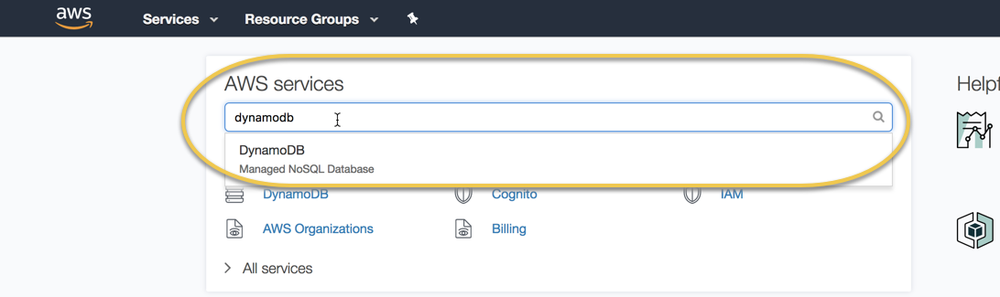
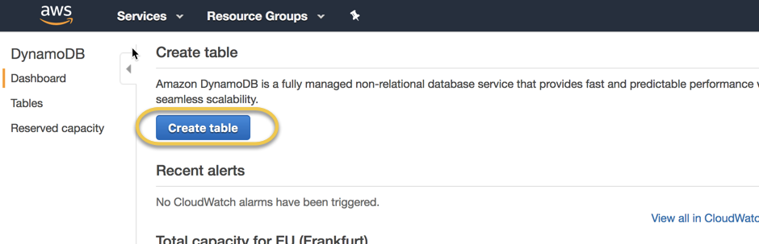
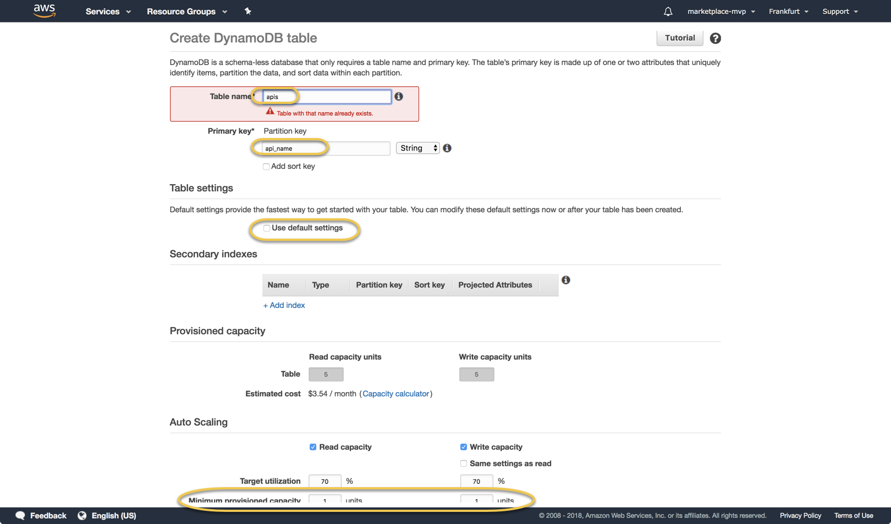
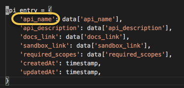

# Persistance - DBaaS

## Perstistance

Every microservice should use it's own persitance layer. Optimally this will be a SasS solution. The current list of database can be discovered [hear](https://db-engines.com/de/ranking) and the [zalando technology radar](./).

#### Architectural Decisions

### When to use NoSQL and when RDBS?

### NoSQL Best Practices

{% embed data="{\"url\":\"https://www.youtube.com/watch?v=-o\_VGpJP-Q0\",\"type\":\"video\",\"title\":\"Modeling Data for NoSQL Document Databases\",\"description\":\"Application developers must support unprecedented rates of change – functionality must rapidly evolve to meet customer needs and respond to competitive pressures. To address these realities, developers are increasingly selecting NoSQL document-oriented databases \(e.g. Azure DocumentDB, MongoDB, CouchDB\) for schema-free, scalable and high performance data storage. One of the oft-cited benefits of NoSQL solutions are that they allow for the storage of schema less data. In reality, however, NoSQL solutions provide for schema flexibility, allowing the system to store data as it comes in, permitting dissimilar structures and encouraging seamless data model iteration. While schema flexibility makes it easy to embrace changes to your data model, data modeling is still important in NoSQL systems. In this session, we’ll discuss not only modeling data in Azure DocumentDB, but also migrating and transforming data from traditional, structured data environments.\",\"icon\":{\"type\":\"icon\",\"url\":\"https://www.youtube.com/yts/img/favicon\_144-vfliLAfaB.png\",\"width\":144,\"height\":144,\"aspectRatio\":1},\"thumbnail\":{\"type\":\"thumbnail\",\"url\":\"https://i.ytimg.com/vi/-o\_VGpJP-Q0/maxresdefault.jpg\",\"width\":1280,\"height\":720,\"aspectRatio\":0.5625},\"embed\":{\"type\":\"player\",\"url\":\"https://www.youtube.com/embed/-o\_VGpJP-Q0?rel=0&showinfo=0\",\"html\":\"
<iframe src=\\\"https://www.youtube.com/embed/-o\_VGpJP-Q0?rel=0&amp;showinfo=0\\\" style=\\\"border: 0; top: 0; left: 0; width: 100%; height: 100%; position: absolute;\\\" allowfullscreen scrolling=\\\"no\\\"></iframe>
\",\"aspectRatio\":1.7778}}" %}

* critical points:
  * embedding vs referencing data
  * reads vs writes
  * normalized vs denormalized vs mixed 

Why DynamoDB?

pynamodb \(ORM\) - my experience \(ask in stack overflow with a link to my describe esperience and the code\) why cann't I serialize it back?

boto3 - prefered way by amazon.

[https://www.youtube.com/watch?v=ONLKIUFXLcg&t=2s](https://www.youtube.com/watch?v=ONLKIUFXLcg&t=2s)

[https://www.uplift.agency/blog/posts/2016/03/clearcare-dynamodb](https://www.uplift.agency/blog/posts/2016/03/clearcare-dynamodb)

1. Go to the [AWS Console](https://console.aws.amazon.com/console/home) and Search for "DynamoDB"

   

2. Create a table e.g. "apis"  
   

   

Important: Partition Key Fieldname can not be changed and it must always be included when you insert data to the database. Like:

Further you validate in your that a valid value was send to your service.

1. Create DynamoDB _table name_ `notes` and _Primary key_ with Partition key `userId` and sort key `noteId` and the default created new _IAM Role_ `DynamoDBAutoscaleRole`.

