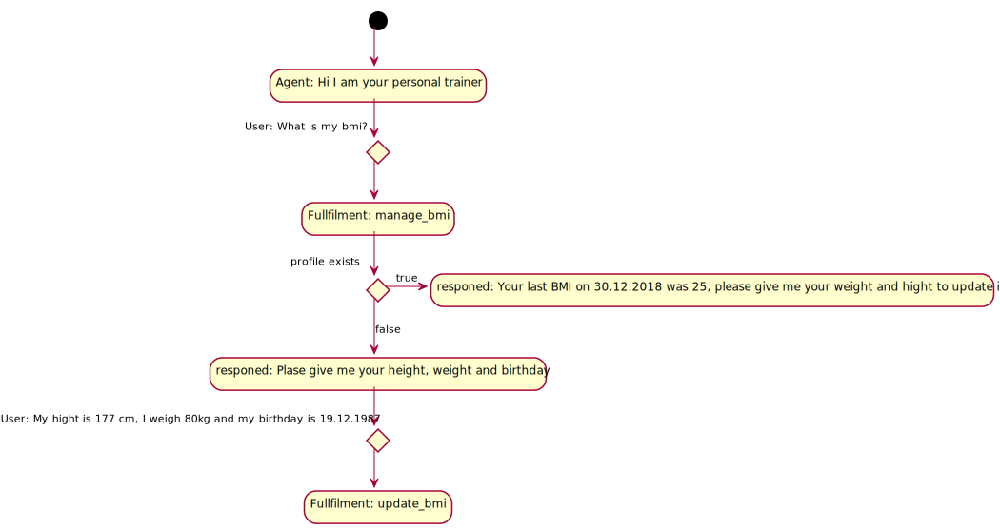
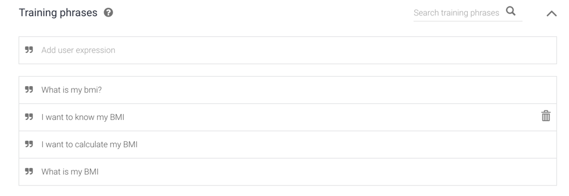
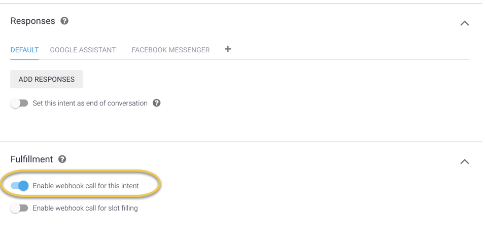

# Chatbots

## Architecture Decisions

* [ADR-0005](https://github.com/denseidel/developer-playbook/blob/master/docs/adr/0005-use-dialogflow-for-chatbots.md) - Use Dialogflow for chatbots

## Dialogflow

### [Getting Started](https://dialogflow.com/docs/getting-started/basics)

### Implement the intent

Guide: [Google Documenation](https://dialogflow.com/docs/getting-started/building-your-first-agent)

#### Model your Dialog

Here is the [plantuml activity diagram](http://plantuml.com/activity-diagram-beta)



[Create a "Default Welcome Intent"](https://dialogflow.com/docs/getting-started/basic-fulfillment-conversation#editing_the_welcome_intent) with answers: "_Hi I am your personal trainer, let me advice you on your health. I can currently calculate your BMI, store the BMI and advices you on your BMI."_

#### Implement a "mange\_bmi" intent 

After creating the intent add training phrases and activate webhook fulfilment \(this is required to check if allready a user exists for this profile\):





Do the same for the update\_bmi intent \(training phrase: My hight is 177 cm, I weigh 80 kg and my birthday is 19.12.1987\). How to handle partial dates \([https://miningbusinessdata.com/dialogflow-tutorial-setting-context-from-your-inline-webhook-using-contextout/](https://miningbusinessdata.com/dialogflow-tutorial-setting-context-from-your-inline-webhook-using-contextout/)\)

### Implement the fulfilment 

To start it makes sense to implement all fulfillments in one webhook on firebases. Later for more complex logic it is adviced to move this logic to it's own webhooks that are then called from the fulfillment webhook. For more details see the later section. 

Setup Firebase \([https://den.gitbook.io/developerplaybook/services-api/firebase](https://den.gitbook.io/developerplaybook/services-api/firebase)\)

```bash
mkdir fulfillment-router
firebase login
firebase init
```

Guide: [Google Documentation](https://developers.google.com/actions/dialogflow/fulfillment)

* _"we highly recommend that you use the Node.js client library to process requests and return responses"_
* 
[https://medium.com/@pallavtrivedi03/how-to-make-a-webhook-for-dialogflow-fulfillment-d02835cc50bf](https://medium.com/@pallavtrivedi03/how-to-make-a-webhook-for-dialogflow-fulfillment-d02835cc50bf)

### Test a chatbot - manually & unit test


### Connect the Chatbot to Facebook Messanger


### Integrate fulfilment with REST Python AWS Lambda \(e.g. "analyse my bmi trend"\) 







