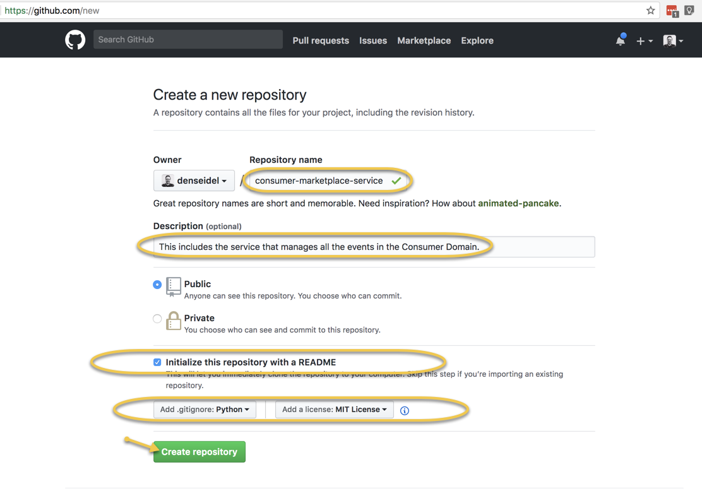

# Containers

## Setup the project

* Create [new github repo](https://github.com/new): 
* Clone repo:

  ```text
  git clone https://github.com/denseidel/consumer-marketplace-service.git
  cd consumer-marketplace-service
  git secrets --install
  git secrets --register-aws
  ```

* Start a virtual environment

  ```text
  virtualenv venv --python=python3
  source venv/bin/activate
  # install pylint 
  pip install pylint
  ```

  If you use visual studio code do this first in your terminal window and then open the folder again with `code .`.

