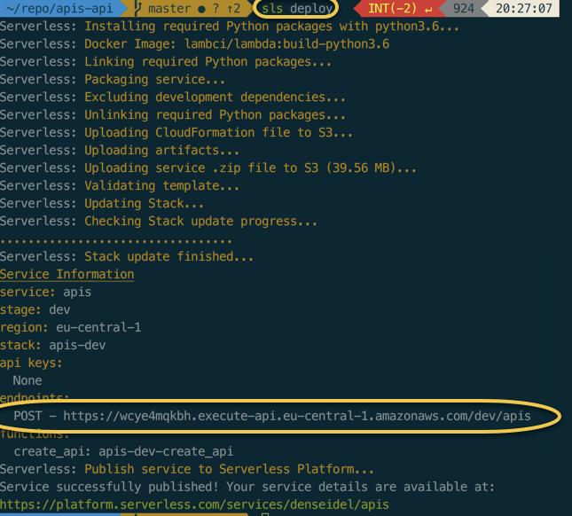
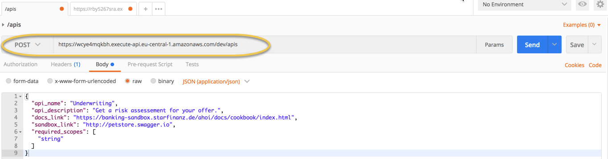
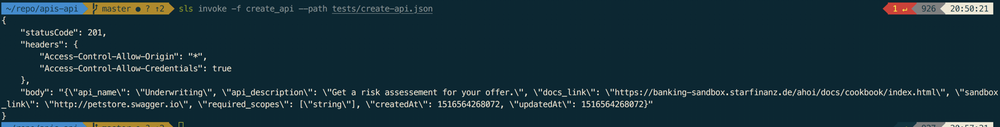

# Serverless

To be as portable as possible, even with severless, we use [serverless framework](https://serverless.com/framework/docs/). It allows us to deploy our functions across multiple clouds like AWS, GCP, Azure and IBM OpenWisk. 

## Setup  & Installation

Make sure you have your [Developer Environment Setup](../development-environment/) 

```bash
npm install serverless -g
# if using gcp
npm install --save serverless-google-cloudfunctions
```

In your repo create your **serverless template for Python**

```text
mkdir notes-app-api
cd notes-app-api
sls create --template aws-python3
```

### Compile non-pure Python modules \(e.g. C?\)

To compile non-pure Python modules, install [Docker](https://docs.docker.com/engine/installation/), the [Lambda Docker Image](https://github.com/lambci/docker-lambda) and [serverless-python-requirements](https://serverless.com/blog/serverless-python-packaging/) . Enable **dockerizePip** in **serverless.yml** and `serverless deploy` again.

```bash
npm init
npm install --save serverless-python-requirements
```

To configure our `serverless.yml` file to use the plugin, we'll add the following lines in our `serverless.yml`:



```yaml
plugins: 
    - serverless-python-requirements 
custom: 
    pythonRequirements: 
        dockerizePip: non-linux
```



## Implementation

### Create virtual env local, activate and deactivate

```text
#http://sourabhbajaj.com/mac-setup/Python/virtualenv.html
virtualenv venv
source venv/bin/activate
deactivate
```

### Install python dependency for this function:

```python
pip install boto3 google-api-python-client requests
```

### Store a reference to my dependencies:

```python
pip freeze > requirements.txt
```

Optional: Re-install the dependencies from the `requirements.txt`:

```python
pip install -r requirements.txt
```

### Implement the function

1. Define the function in the `serverless.yml` including the events \(e.g. http\) that trigger the function and the handler
2. Implement the unit test: what is the best serverless unit test framework for python?
3. Implement the handler function in `handler.py`
4. Test the function locally

```text
sls invoke local --function create_api --path tests/create-api-event.json
sls invoke local -f hello
```

Run the unit tests

```python
python -m unittest discover -s tests
```

### Examples

{% embed data="{\"url\":\"https://github.com/serverless/examples\",\"type\":\"link\",\"title\":\"serverless/examples\",\"description\":\"Serverless Examples – A collection of boilerplates and examples of serverless architectures built with the Serverless Framework and AWS Lambda\",\"icon\":{\"type\":\"icon\",\"url\":\"https://github.com/fluidicon.png\",\"aspectRatio\":0},\"thumbnail\":{\"type\":\"thumbnail\",\"url\":\"https://avatars3.githubusercontent.com/u/13742415?s=400&v=4\",\"width\":400,\"height\":400,\"aspectRatio\":1}}" %}

## Deployment

### Deploy a project

```text
sls deploy
```



The deployment takes very long. I have to see how to optimize this.

#### Test the deployed function

You can use the endpoint endpoint and use Postman to make a "real world" request: 

Or you can use the CLI and use:

```text
sls invoke -f create_api --path tests/create-api.json
```



### Deploy single function

```text
sls deploy function --function hello
```

## Sources:

* [https://github.com/serverless/examples/tree/master/aws-python-pynamodb-s3-sigurl](https://github.com/serverless/examples/tree/master/aws-python-pynamodb-s3-sigurl) 
* [https://github.com/AnomalyInnovations/serverless-python-starter](https://github.com/AnomalyInnovations/serverless-python-starter)
* [https://serverlesscode.com/post/python-3-on-serverless-framework/](https://serverlesscode.com/post/python-3-on-serverless-framework/)

## 

